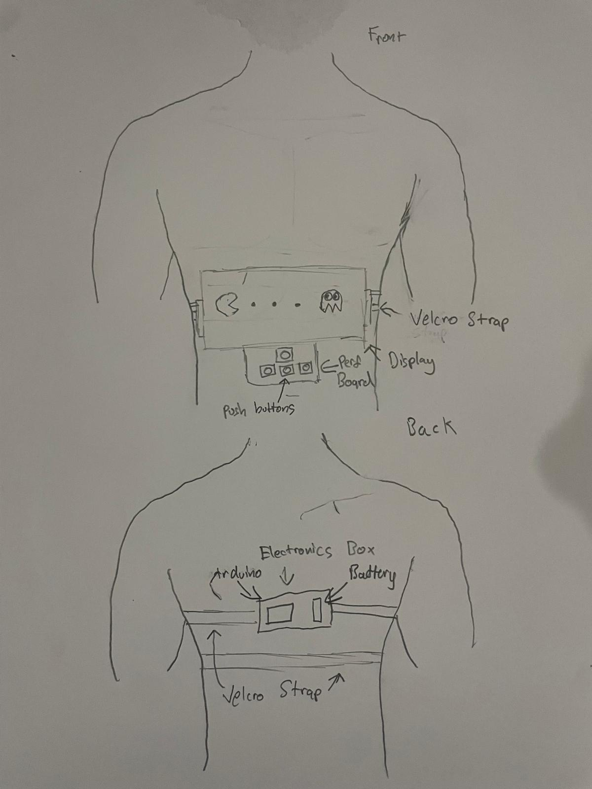

# PixelChest
A wearable chest-mounted LED arcade game - PacMan -  powered by Arduino and a 16×32 programmable LED matrix

 <!-- Optional: replace with your image -->

## Overview
**PixelChest** is a wearable, chest-mounted LED game built around an **Arduino Uno R3** and a **16×32 programmable LED matrix**. Players can control a Pac-Man style game using **buttons mounted on a vest or belt**, creating a visually striking and interactive wearable experience. 
---

## Features
- **Arduino Uno powered** — runs all game logic locally  
- **Chest-mounted LED matrix display** — 16×32 pixels, visible from a distance  
- **Pac-Man / retro arcade gameplay** — dots, ghosts, and score animations  
- **Input via buttons** — control character movement easily  
- **Battery-powered** — fully portable with a 3.7 V LiPo + boost converter  
- **Customizable** — game speed, LED brightness, and animations adjustable  

---

## Hardware Components
| Component                  | Description                                                      |
|-----------------------------|------------------------------------------------------------------|
| Arduino Uno R3              | Main microcontroller controlling the game                        |
| 16×32 Programmable LED Matrix | Flexible LED display panel for the game                           |
| Buttons                     | Player input for controlling movement                             |
| 3.7 V 2000 mAh LiPo Battery | Power supply for the LED matrix via boost converter              |
| 5 V Boost Converter         | Steps up battery voltage to safely power the LED matrix and Arduino |
| Wires, Connectors           | For connecting components and mounting the display               |
| VelcroStraps      | To mount the display comfortably on the wearer                   |
| Capacitor (1000 µF+)        | Stabilizes LED power to prevent flickering                        |

---

